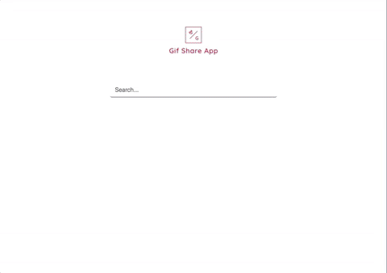

## Gif Share Application
Single page app that allows you to search in thousands gifs from Gyphy database.

## Libraries used
React, Bootstrap, [React-share](https://www.npmjs.com/package/react-share)

## Features
- Fast search as you type a query
- Social sharing shortcuts
- Mobile responsive design

## Screenshot

## Live Version
https://baranov.dev/gifshare/
Deployed on DigitalOcean platform

## Installation
- git clone https://github.com/gbaranov/gifshare.git
- npm install
- Edit "homepage" in package.json
- npm run build
- run index.html
